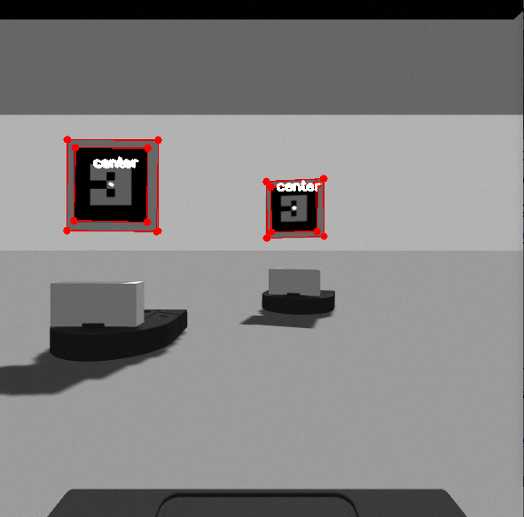
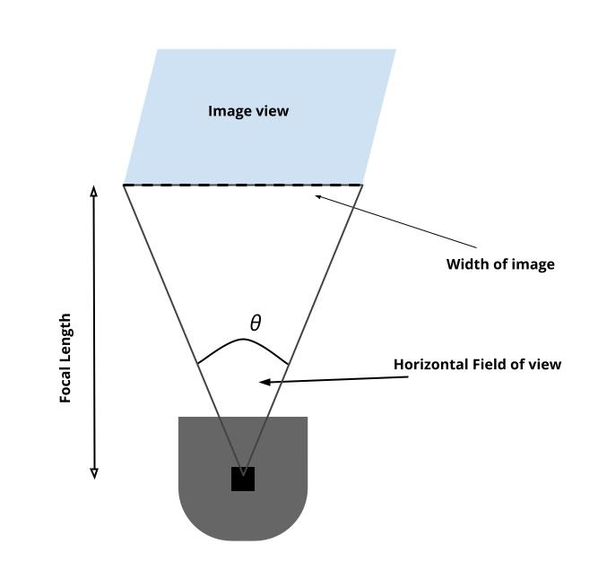

# Follow the Neato
*CompRobot Final Project* 
Richard Gao and Anna Griffin
 

## Introduction
Following a leader is common behavior in robots. It requires a level of autonomy from the followers and an ability to react to the movements of another object in their field of view. Over the course of the semester, we worked together to implement a version of this system ourselves.  There are two main challenges that come with implementing a follow the leader system. The first is figuring out how the followers can detect the leader robot. We have chosen computer vision as our detection method and relied on the OpenCV library. The second half of the problem is determining a control system for the follower to describe the following actions. After research on different implementation methods, we have decided that Fuzzy Logic was the best fit for our project. 

## Demo

## Implementation

### Finding the Leader
#### AR Tags
The first part of our project involves detecting and tracking a leader robot using computer vision. We modified the neato models with an AR tag so that they could be easily detected. Each robot has the same tag at the moment. That was an intentional decision that we made after we began implementation. Having unique tags on each robot would be necessary further down the road, especially when more robots get added, but it was not needed at the moment we discovered. The tag sits above the neato's body so that it remains clear of the camera. 
[image of robot with ar tag]

#### OpenCV
For the computer vision aspect of this project, we used OpenCV and the CVBridge package which allows seamless conversation between ROS image messages and OpenCV images. We subscribed to the `{robot}/camera/raw_image` topic to visualize what the robot was “seeing”. When a robot with a tag enters the view, the robot will know it is a leader if it detects the tag properly. The process for identifying the tags we put on the robots mainly consisted of general filtering and contour detection. Since there are always going to be other objects in view, like the robot the tag is attached to, it was important that we find a robust way to select the correct contour that outlined the tag. We approached this in a few different ways. We set bounds for the min and max area within the contours and approximate the contour using `cv2.approxPolyDP()` so that we can tell if it has a relatively rectangular shape. 

At this point, it is possible that there are multiple tags in a few that are being detected, therefore we need to be able to determine which one is the correct robot to be following. When OpenCV finds the contours, it also returns a hierarchy array depending on the retrieval mode that sorts and connects the contours in a specified way. We used `cv2.RETR_CCOMP` which distinguishes boundaries and holes. There are only two levels here which was enough information for this scenario.

The border on which the tag is mounted and the AR tag itself would often both get detected. The border was placed so that if multiple tags were in view but overlapping, the tag could still be identified which didn’t work without a border because of perspective. With further filtering of the detected contours, we could separate the external boundaries and the holes but looking at the hierarchy array. Another situation that we had to account for was when multiple tags were detected at once. We found the contour with the greatest area and took that as the leader’s position for that specific robot. 

##### Dealing with multiple tags
A minor change that we had to make after integrating and realizing that we didn’t account for when multiple tags were in the view of a single robot. This situation occurred when there were three or more robots. When the robots were in a line, often the robots towards the back would detect the tags of all of the robots ahead of it. Since multiple center points would be calculated, multiple angles would also be published to the topic. This was a blind spot we had when we were just testing with two robots. It quickly became apparent when there were three in a line and the farthest one back would pick up both tags. To address this obstacle, we used the hierarchy of contours that is returned from the findContours function. We could filter out the inner squares and then search for the largest which would belong to the closest detected tag and only one angle would get published. 

Another modification we made after beginning integration was adding a thin, white boarder to the tags. We found that if there were multiple robots in view and one was overlapping the other, in other words, a corner was blocked, the tags could not be detected properly. The fix was rather simple, we added a box to the model so that the black tag's corners would be more clear and not blend into another tag. There are other ways we had thought about addressing this problem, but this seemed to be very robust and worked for the level of complexity of the project. 

    |  
:-------------------------:|:-------------------------:
Detecting Multiple Tags  |  Revised Tag Detection

#### Publishing the Angle
An important piece of information that the controller needs is the offset angle of the detected robot. The controller uses this information to determine how the robot moves in order to stay in the follow formation. Whenever an angle is calculated, it gets published to `/{robot}/angle_to_leader` topic so that it is available to the controller. 

To obtain the angle from the image view, we used the width of the camera image, and the horizontal field of view. A nice thing about working in the simulator is that we didn’t have to do much camera calibration. The camera doesn’t distort the image, unless specified, according to the [documentation](ros gazebo camera documentation link).  The `/camera/camera_info` [topic](http://docs.ros.org/en/melodic/api/sensor_msgs/html/msg/CameraInfo.html) provides the details about the camera’s calibration. We could double check the distortion values by subscribing to this topic to make sure what we read about the camera in gazebo checked out. 

The angle changes as leader changes place. When the robot is directly in the center of the view, the angle would be 0 degrees. When the robot is in the left side of the view, the angle is negative and when its on the right, it is positive. The horizontal field of view of the camera is 80 degrees in our case. This means that the angles should range from -40 to 40 degrees. The actual range for detecting robots in view is slightly more narrow than that. The angle is calculated with the center point fo the detected tag. In order for the tag to be detected, all four corners must be visible. This means that the center point can't be all the way on the edge of the camera view even though it is still in the view.

#### Finding the distance
We also could get the distance from camera calibration and the image view. This turned out to not be necessary since we relied on the neato's lidar detection, but we calculated it anyways to have a fall back and we were learning about camera,calibration, and distortion. The horizontal field of view was set for us in the camera model and using that, the focal lengh can be found by calculating `(width / 2) / tan(h_fov/2)` where `h_fov` is in radians.

    |  
:-------------------------:|:-------------------------:
Detecting Multiple Tags  |  Revised Tag Detection

### Controller

### System Architecture
Within our system, there are two different roles the robot takes on, they are either a leader or a follower. The leaders are controlled though a teleop keyboard control. The followers have cameras and when they have detected a leader's tag, they used tracking to determine how to move in order to stay in pursuit. The main piece of information that the followers use is the angle between them and the detected leader. 

### Read on!
Visit our project [website!](https://annagriffin.github.io/swarm_follow_leader/)

