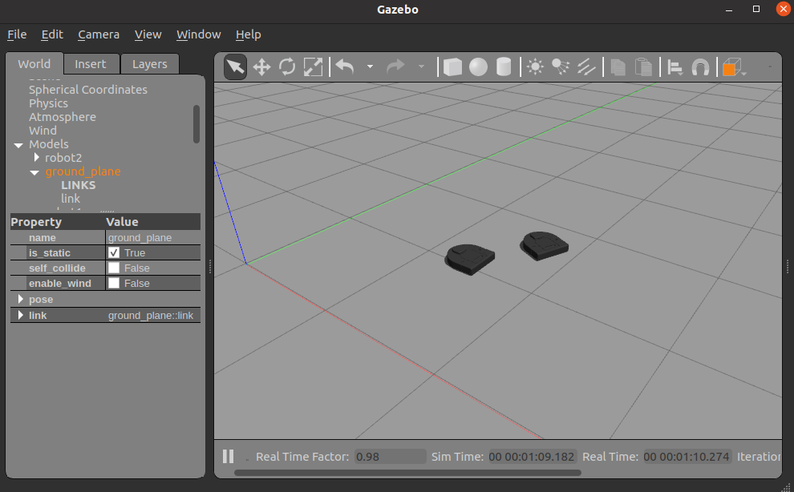

# Blog Post 1
*November 23, 2020*

## Pivot
We started the final project with the idea to look into and replicate some method of swarm cooperative transport spurred on by our interest in swarm robotics. The aspect of having multiple robot agents working together in a collaborative task was appealing. However, upon digging deeper into the topic space and [existing implementations](https://www.frontiersin.org/articles/10.3389/frobt.2018.00059/full) we realized the magnitude of the task that lay before us. The current methods in place all involve a heavy lift in physics and simulation which given the project timeline and our learning goals didn’t make sense to commit to. Therefore, we decided to take a step back and access what interested us in the swarm robotics space in the first place. With careful thought, we realized once again the aspect of building out a multi-robot system that cooperates with one another is what generates the most excitement for us.

## A New Project Idea
Keeping this in mind, we were able to generate another idea that is within scope and that can satisfy the same learning goals that we have previously stated. We switched to follow the leader with multiple robots and computer vision. One robot will start out as the leader and traverse the space in search of other robots. When one of the robots spots the leader, they will move towards it and fall into line behind it. The leader and its followers will continue moving throughout the space until all of the stray robots are picked up and in line. We have a few extension ideas that we will gauge closer to achieving the milti-robot find and follow capabilities.

## Multiple Robots in Gazebo
Looking into which simulator to use, we explored potential options like ARGoS and Netlogo. However, we decided to stick with Gazebo for our simulator because that is what we know best and it should work fine given we don’t intend on having a swarm consisting of tens of robots. To simulate multiple robots in gazebo we create a launch file that spawns each robot in its own [namespace](https://www.theconstructsim.com/ros-qa-130-how-to-launch-multiple-robots-in-gazebo-simulator/). Doing this will let ROS communicate with each robot’s topic within its specific namespace (ex. /robot1/cmd_vel). However, there seems to be a warning that is published repeatedly, TF_REPEATED_DATA, complaining about redundant information from wheel_links. We will try to look into it, but it doesn’t seem to cause any known problems currently outside of clogging the debug terminal with warnings. 

*Multiple Neatos spwaned in Gazebo world*

 

## AR Tags for Identification
Now that we are working with multiple robots in the same environment, we need a way to identify them given they will each need to respond and behave differently depending on their role. We explored a few options of tracking and identification and decided to look into AR tags. We found a comprehensive ROS package that utilizes Alvar’s tracking library. With the AR tags and computer vision, we can track objects, estimate pose, and estimate relative positioning of different objects. 

As the main robot is exploring, other robots must be able to recognize it and get in line at the back. It is important for the robots that join to be able to orient themselves within the line and maintain proper position relative to the one in front of it. 

The AR tags currently are models that are linked to the Neato models. This will ensure that they stay with the Neato as well as in the same position relative to the body. To generate the models, we leveraged this [gazebo_models](https://github.com/mikaelarguedas/gazebo_models) repo to convert png files to Gazebo models. The tags are squares that can be placed perpendicular to the body of the Neato where it will be visible in the other robot’s field of view. 

We are trying to decide if having a unique tag on each robot is unnecessary. After sharing our progress and uncertainties with our small focus group in class, some people offered suggestions or insights that we may have overlooked. We are now thinking about putting the same identification on each robot, but with different tags facing either direction to convey orientation. This could simplify our environment and still provide the information we need to get one robot to follow after another. 

*Neato in Gazebo with an AR tag placed on top for identification*
