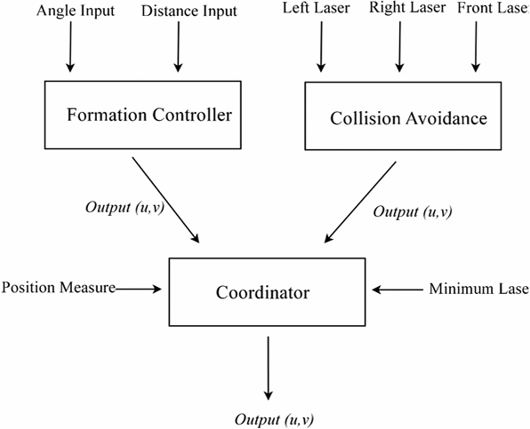

## AR Tags
The model that we had in the previous post was mostly for proof of concept. It was important to fix the tag to the robot so that it always stayed in the same position relative to the robot as it moved around. One bump in the road that we hadn’t anticipated was the different model formats. The Neato model was written as a URDF model which is used in ROS while the markers we had generated were in SDF file, a gazebo specific format. What now seems trivial took a bit of experimenting. At first we tried converting from URDF to SDF. There were some converters and archives in the CompRobo repository, however, they were not exactly what we needed and further complicated the union. Eventually, we digested the URDF files and translated the tag model by adding a link and fixed joint. It was much more simple to modify the URDF file and tweak the links than to try and convert the other way around. 

## OpenCV
After successfully spawning multiple robots with tags into our world, checking their vision was the next logical step. We chose to use the OpenCV library since we both have had experience working with it in previous projects. We took advantage of the [CVBridge](http://wiki.ros.org/cv_bridge) package which converts ROS image messages and OpenCV images. After subscribing to the `/camera/raw_image` topic, we used the bridge to convert to an OpenCV image for processing. 

Our goal from here was to detect and identify AR tags in the robot’s field of view. The AR tags are easy to spot because they have a very distinct pattern. Through simple edge filtering and contour detection, we can pull out the contours with four distinct points. Unless the leader robot is directly in front of the follower robot and square on, the contour detecting will not be a square. In order to correct this distortion, OpenCV can calculate the homography matrix to find the transformation between the planes of the two AR tags. The matrix can be used to warp the raw image onto a parallel plane. After correcting for the distortion, the tag and the information on it can be more accurately interpreted. The next step is to use this relationship to calculate the relative pose. 

## Robot Controller
When approaching designing a controller for the leader follower problem we had two trains of thought. The first was to design some PID control and tune parameters, sort of brute forcing a solution to get the intended behavior. The other was to look into existing implementations to see more robust solutions and borrow some of logic there into our own solution. Looking into the swarm leader follower space, we stumbled upon multiple papers talking about Fuzzy Logic and Fuzzy Logic Controllers to build the control scheme. Never having worked with anything using fuzzy logic, this intrigued us and called for further investigation.

## Fuzzy Logic
Having committed to learning more about fuzzy logic, we dived into exploring this technology. Using [MATLAB’s fuzzy logic tutorial](https://www.mathworks.com/help/fuzzy/getting-started-with-fuzzy-logic-toolbox.html) and [this youtube series](https://www.youtube.com/playlist?list=PL5cGuSxneHHd7X4ZbHs8DPbRnoiYixpBA) we developed an understanding of the fuzzy logic and Fuzzy Logic Controller (FLCs). Essentially, fuzzy logic approaches computing based on “degrees of truth” rather than the binary boolean logic that we are used to. This allows you to approach problem solving using something closer to human intuition. With “degrees of truth”, fuzzy logic is able to describe sets, called fuzzy sets, using linguistic states (variables/words that represent a range of values). The ability to linguistically process uncertain data using engineered IF-THEN rules works well when having to design for complex non-linear systems that are not easily modeled with exact mathematics. In fact, fuzzy logic is part of what is considered soft computing. Unlike the traditional hard computing, soft computing “accommodates the imprecision of the real world.” This works well in our case where each robot that is part of the leader follower system needs to react appropriately to obstacles in the world and the moving robot in front of it that it needs to follow. Therefore, the extension of fuzzy logic, the fuzzy logic controller, is an appropriate solution to creating a decentralized swarm robotic system.

## FLC for Leader Follower
There are multiple ways to design the inference needed in a FLC. We decided to go with the Mamdani fuzzy inference system as it is intuitive and the most widely used. The FLC, using the Mamdani approach, takes multiple steps. Starting with some crisp (non-fuzzy) input the FLC performs fuzzification, applies the defined fuzzy inference rules, aggregates the outputs and then defuzzifies to produce a singular crisp numerical output. 

*This diagram shows the Mamdani fuzzy inference system for the famous “tipping problem”.*

For our leader follower, we decided to loosely follow [this paper](https://ieeexplore-ieee-org.olin.idm.oclc.org/document/4058766?arnumber=4058766), using the multiple FLCs for formation control, collision avoidance, and motor control fusion. Our implementation differs from the paper’s in that we are using the AR tags and computer vision to determine the angle offset from the follower to leader and lidar to determine distance values to feed into the formation controller. This allows us to create a decentralized system as opposed to the centralized one used in the paper where they had to relay the leader position to each robot. Therefore, though our rule base will be different, we are hopeful our results will be pretty inline with what the paper was able to achieve.

## Implementation
Currently we have started implementing the controller code. We are using a library called [pyfuzzylite](https://github.com/fuzzylite/pyfuzzylite) that has helpful fuzzy logic functions already pre-defined. This makes setting up a FLC a lot more straightforward as we don’t have to reimplement commonly used fuzzy functions. Currently, our controller consists of function templates waiting to be implemented. But the ROS architecture is properly laid out with each method’s signature and docstring already defined. What’s left to do is define the rule base, apply the pyfuzzylite library, calculate offset angles, and integrate with the AR tag system.